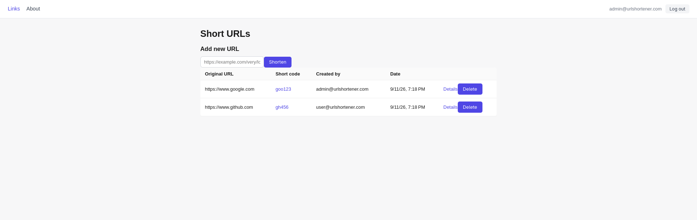
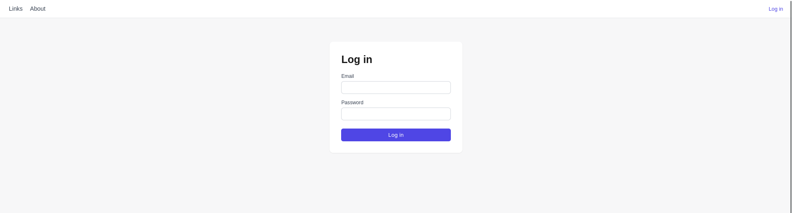
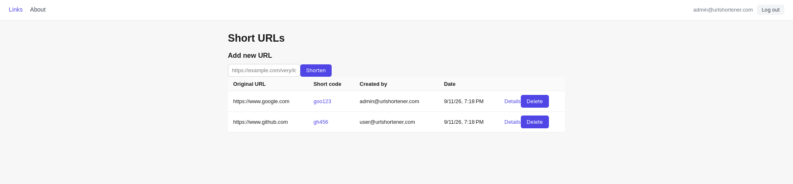
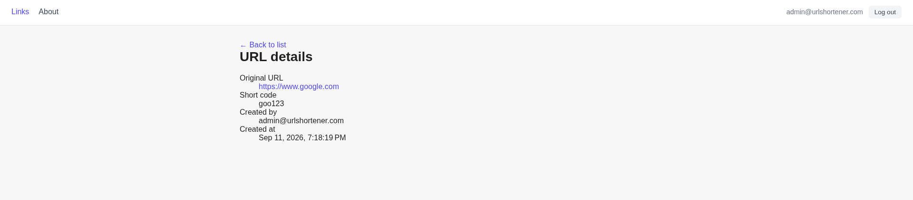
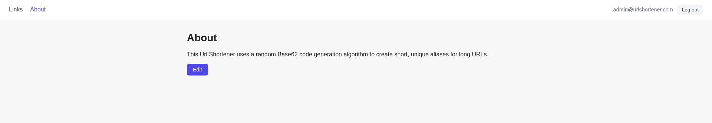

# URL Shortener


A full-stack URL Shortener built with **ASP.NET Core** and **Angular**, featuring JWT authentication, role-based access control, and real-time link management without page reloads.



## Tech Stack

**Backend:**
* **ASP.NET Core Web API** — controller-based API (`US.API`)
* **Entity Framework Core** — code-first approach
* **JWT Authentication** — bearer tokens with role-based authorization (`User` / `Admin`)
* **Dependency Injection** — built-in .NET DI container

**Frontend:**
* **Angular** — standalone components, signals, new `@if` / `@for` control flow
* **Reactive Forms** — form validation
* **RxJS** — HTTP interceptors for auth and error handling

## Architecture

The backend follows a layered architecture:

* **API** — controllers, HTTP endpoints, request/response handling (`US.API`)
* **BLL** — business logic, services, DTOs (`US.BLL`)
* **DAL** — EF Core entities, enums, DbContext, code-first migrations (`US.DAL`)

The frontend is a standalone Angular SPA with a `core` layer (services, guards, interceptors, models) and a `features` layer (Login, Short URLs Table, Short URL Info, About).

## Roles & Permissions

| Role | Add URL | View Details | Delete URL | Edit About |
| :--- | :--- | :--- | :--- | :--- |
| **Anonymous** | — | — | — | — |
| **User** | ✅ | ✅ | Own URLs only | — |
| **Admin** | ✅ | ✅ | All URLs | ✅ |

## Features

* JWT authentication — login with email/password, role-based access control
* Short URL creation — converts any URL into a short code, rejects duplicates with a clear error message
* Short URLs table — live updates on add/delete without a page reload, delete restricted by ownership/role
* Short URL redirect — visiting a short link (`/{shortCode}`) redirects to the original URL
* Short URL Info page — shows creator and creation date, accessible only to authenticated users
* About page — visible to everyone, editable only by admins, implemented as a Razor Page

## Screenshots

### Login


### Short URLs Table


### Short URL Info


### About


## Getting Started

### Prerequisites
* [.NET SDK](https://dotnet.microsoft.com/download)
* [Node.js 20+](https://nodejs.org/)

### 1. Clone the repository
```bash
git clone https://github.com/Am0rr/Url-shortener-api
cd Url-shortener-api
```

### 2. Configure environment variables

Set up your database connection string and JWT options in `US.API/appsettings.json` (or via environment variables):

```env
MSSQL_SA_PASSWORD=ChangeMe123!
MSSQL_PORT=1433
DB_NAME=UrlShortenerDb

Jwt__SecureKey=YourSuperSecureKey
Jwt__Issuer=UrlShortenerApi
Jwt__Audience=UrlShortenerClient
Jwt__AccessTokenLifetimeInMinutes=60
```

### 3. Run the backend

```bash
cd US.API
dotnet ef database update
dotnet run
```

API will be available at: `http://localhost:5091`

### 4. Run the frontend

```bash
cd frontend
npm install
ng serve
```

App will be available at: `http://localhost:4200`

### 5. Create an Administrator

There is no public registration endpoint. Seed an admin user directly in the database (or via a seed migration), then log in with those credentials on the Login page.

## API Endpoints

### Auth (`/api/auth`) — Public

| Method | Endpoint | Description |
| --- | --- | --- |
| `POST` | `/login` | Authenticate and receive a JWT access token |

### Short URLs (`/api/shorturls`)

| Method | Endpoint | Access | Description |
| --- | --- | --- | --- |
| `GET` | `/` | Anonymous | Get all short URLs |
| `GET` | `/{id}` | Authenticated | Get short URL details by ID |
| `POST` | `/` | Authenticated | Create a new short URL |
| `DELETE` | `/{id}` | Authenticated | Delete a short URL (own URLs for users, any URL for admins) |

### About Content (`/api/aboutcontents`)

| Method | Endpoint | Access | Description |
| --- | --- | --- | --- |
| `GET` | `/` | Anonymous | Get the About page content |
| `PUT` | `/` | Admin only | Update the About page content |

### Redirect

| Method | Endpoint | Access | Description |
| --- | --- | --- | --- |
| `GET` | `/{shortCode}` | Anonymous | Redirects to the original URL for the given short code |
